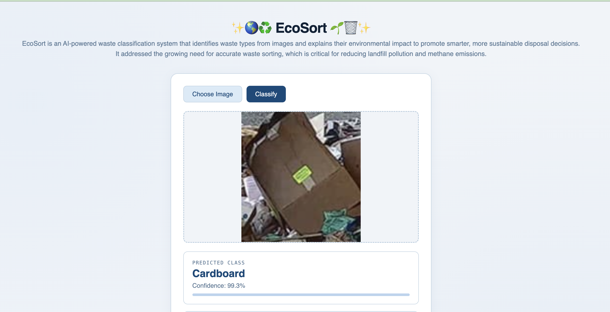

# ✨🌎♻️ EcoSort 🌱🗑️✨ - Waste Classification Model
**EcoSort** is an AI-powered waste classification system designed to identify waste types from user-uploaded images. To promote sustainability, the system explains the environmental impact of each item, encouraging smarter and more sustainable disposal decisions. This project addresses the critical need for accurate waste sorting, which is essential for reducing landfill pollution and methane emissions. This work was developed for CS 350: From Data Mining to Deep Learning, offered in Spring 2026 at Elizabethtown College.

